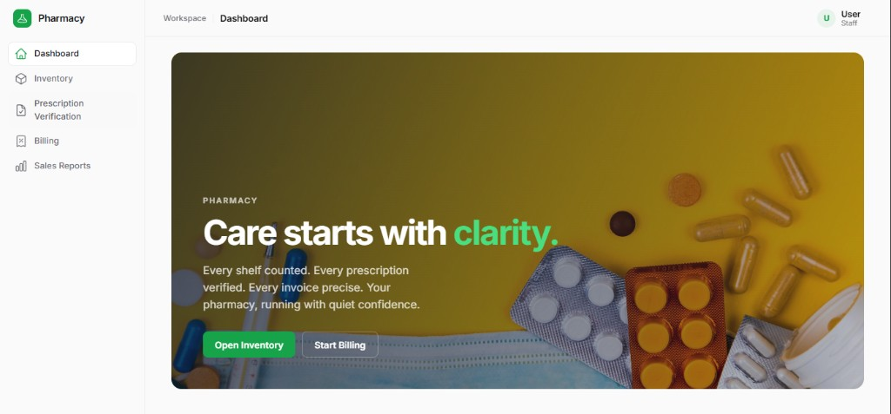
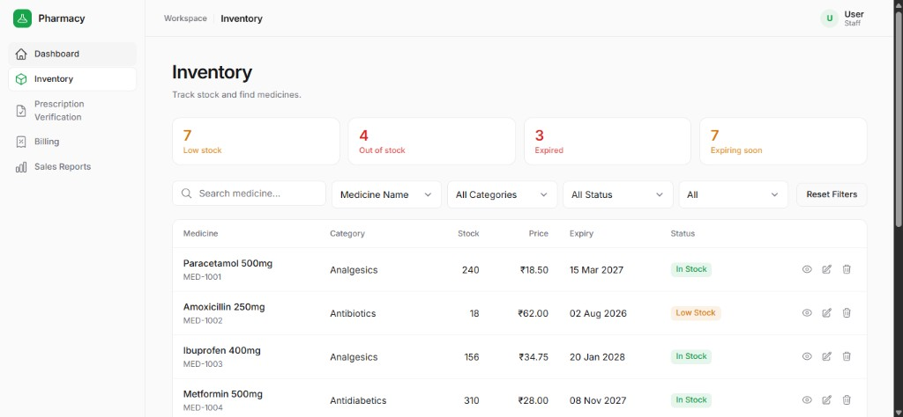
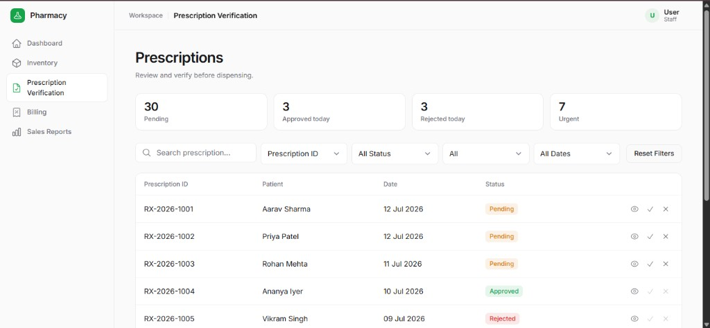
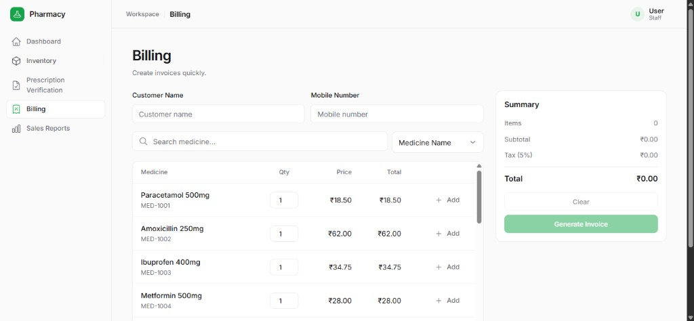
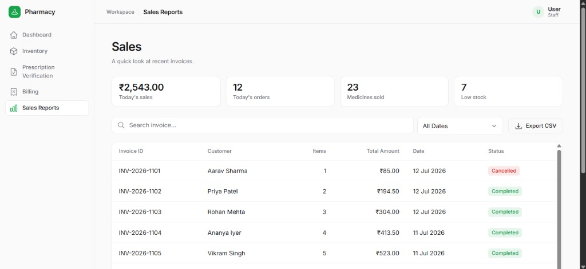
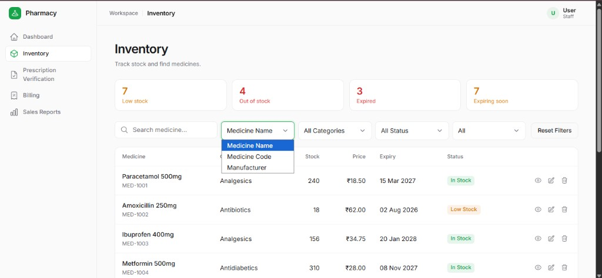
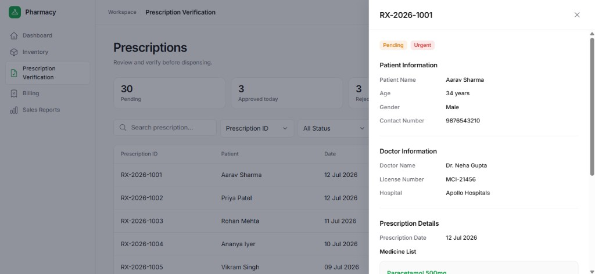

# Pharmacy Management System

A clean, modern frontend for pharmacy operations — inventory, prescription verification, billing, and sales — built with React and Vite.

Designed with a **Less UI, Better UX** approach: focused screens, compact metrics, and minimal noise.

---

## Features

- **Dashboard** — Welcome hero with quick links into core modules
- **Inventory** — Search/filter medicines, stock alerts, status badges
- **Prescription Verification** — Review, approve, or reject prescriptions
- **Billing** — Build invoices, tax summary, printable invoice modal
- **Sales Report** — Daily overview, invoice table, CSV export

---

## Tech Stack

| Layer | Choice |
|-------|--------|
| UI | React 19 |
| Build | Vite |
| Routing | React Router |
| Icons | React Icons |
| Styling | CSS (design tokens) |

---

## Getting Started

### Prerequisites

- Node.js 18+ recommended

### Install & run

```bash
npm install
npm run dev
```

App runs at `http://localhost:5173` (or the port Vite prints).

### Build

```bash
npm run build
npm run preview
```

---

## Screenshots

> Drop your screenshots into `docs/screenshots/` using the filenames below.  
> Until then, placeholders are listed so the README structure is ready.

| Screen | Preview |
|--------|---------|
| Dashboard |  |
| Inventory |  |
| Prescription Verification |  |
| Billing |  |
| Sales Report |  |

### Optional detail shots

| Screen | Preview |
|--------|---------|
| Inventory — stock alerts / filters |  |
| Prescription — detail drawer |  |
| Billing — invoice modal |  |

**How to add screenshots**

1. Capture each page (full width, light theme).
2. Save PNGs into `docs/screenshots/` with the names above.
3. Refresh GitHub — images will render automatically.

---

## Project Structure

```text
src/
  components/
    common/          # Button, Input, Table, Dialog, Drawer, …
    layouts/         # Sidebar, Navbar, AppLayout
    layout/          # PageHeader
  pages/
    inventory/       # Inventory UI pieces
    prescription/    # Prescription verification UI
    billing/         # Billing / invoice UI
    sales/           # Sales report UI
  constants/         # Routes, filters, status maps
  data/              # Mock medicines, prescriptions, invoices
  hooks/             # useDebounce, …
  utils/             # Filters, formatting, totals
  styles/            # Theme tokens
  routes/            # App routes
```

---

## Modules (quick tour)

### Inventory
Search by name/code/manufacturer, filter by category / stock / expiry, click stock alerts to filter the table.

### Prescription Verification
Pending queue with approve/reject dialogs and a side drawer for full prescription details.

### Billing
Select medicines, set quantity, live totals (subtotal + 5% tax), generate invoice.

### Sales Report
Today’s metrics, searchable invoice list, date filter, export CSV.

---

## Scripts

| Command | Description |
|---------|-------------|
| `npm run dev` | Start development server |
| `npm run build` | Production build |
| `npm run preview` | Preview production build |
| `npm run lint` | Run ESLint |

---

## Notes

- Data is **mock / client-side** for assignment demo purposes.
- Global navbar search was removed (no backend search yet).
- Module-level search and filters are fully interactive.

---

## License

Private / assignment use.
